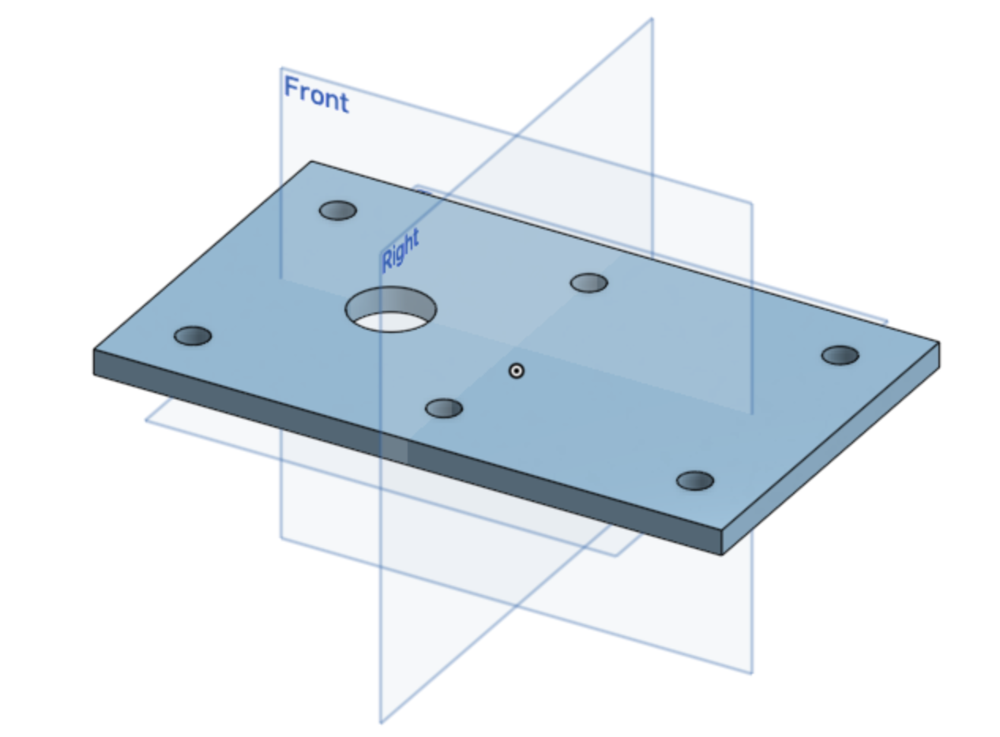
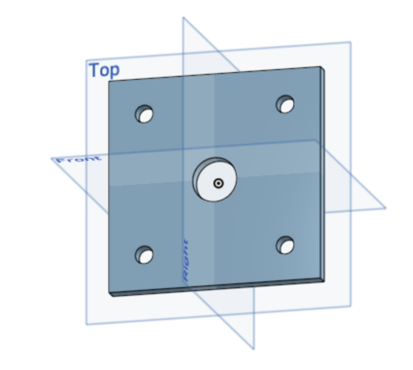
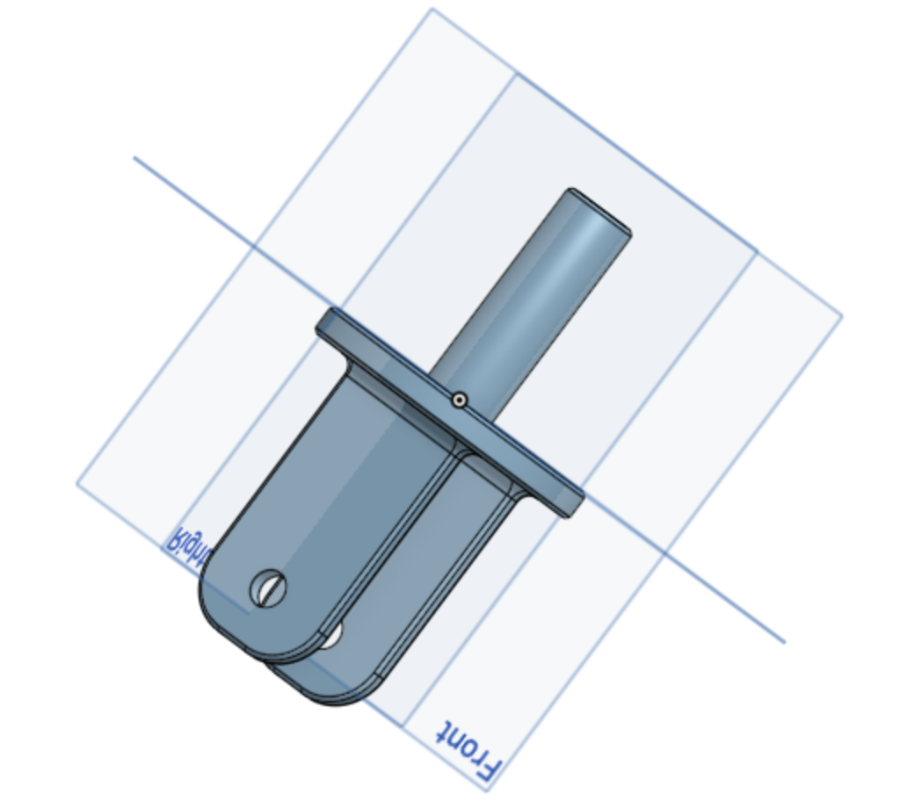
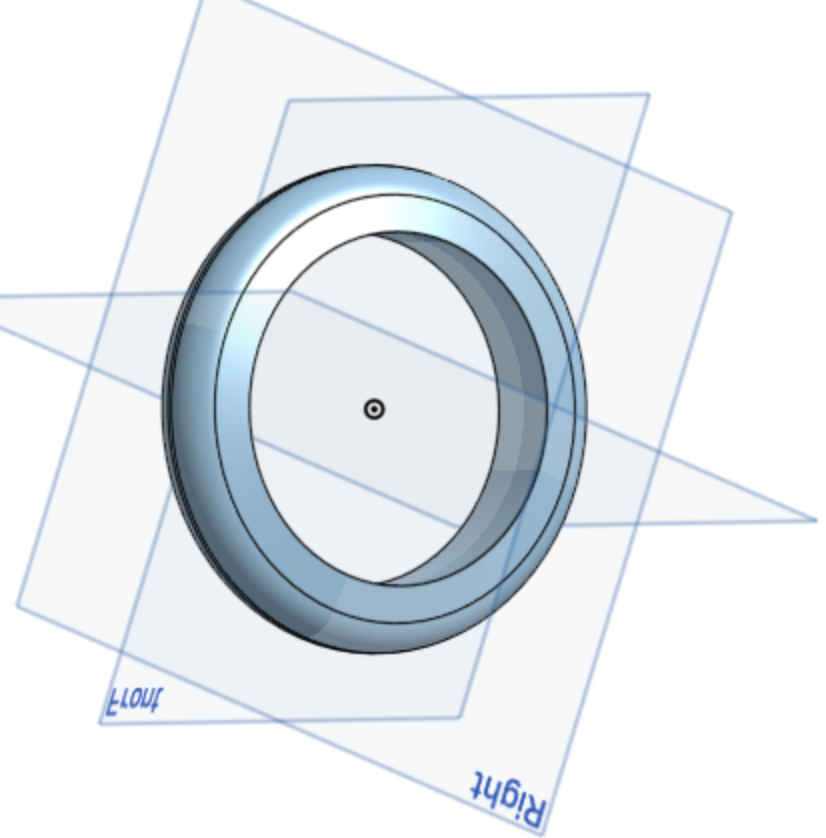
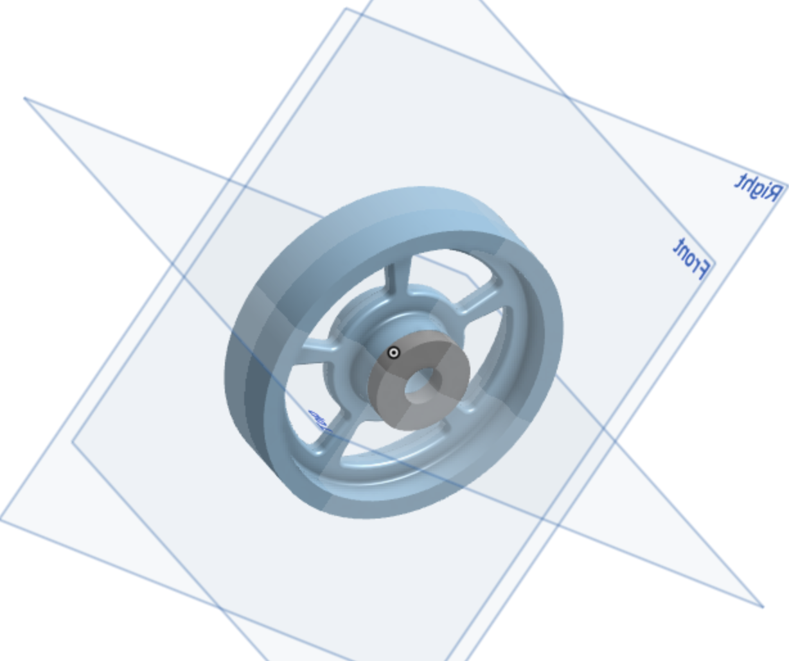
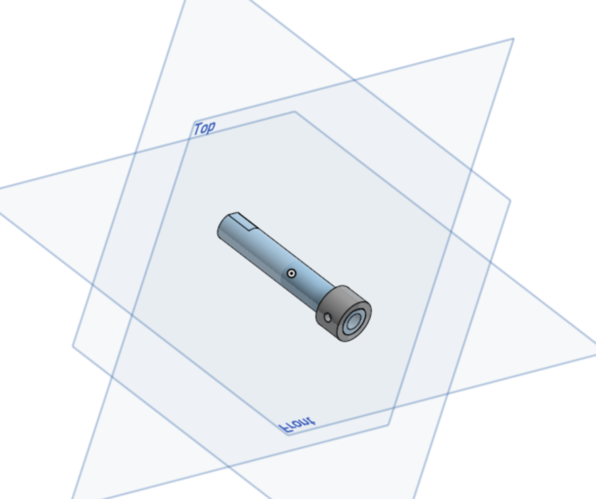
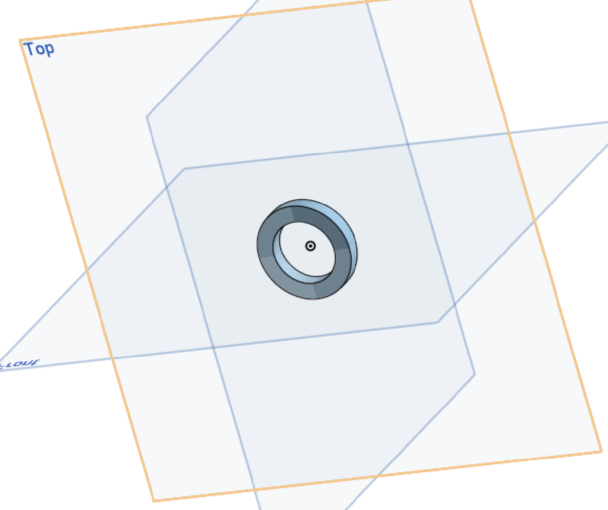

# Basic_Onshape_CAD
Onshape CAD for Engineering 4

## Part 1 - Base

### Lesson Learned
I had trouble understanding the way sketches and dimensions worked within Onshape, but as I continued the part I started to get the hang of dimensions. Without the video Dr. Shields provided I probably wouldve taken much more time to finish this piece.

### Picture

## Part 2 - Mount

### Lesson Learned
As this one was very similar to make like the last one, it was easier for me to go through the motions of where to find the different tools to dimension and constrain the part. The video was helpful and watching him make it 3 different ways really showed the longevity of Onshape and how much different it is than Solidworks.

### Picture

## Part 3 - Fork

### Lesson Learned
Last year I had the most trouble making this part when doing this assembly, but that was not the case this year. I knocked this out in about 15 minutes and it baffled me how fast and easy Onshape makes some of the tools. The craziest part for me was doing Fillets and since it has Tangent Propagation, I only had to select 5 lines total and the whole thing was filleted. Last year you would have to select 10 or 15.

### Picture

## Part 4 - Tire

### Lesson Learned
In SolidWorks, making this part was relatively easy, the only hard part being the symmetric and the fillet but in Onshape it was so much easier. I like the accessibility of the relations like how coincident, symmetric, horizontal and others are all under 1 tab. It makes this part really easy!

### Picture

## Parts 5 & 8  - Wheel and Bearing

### Lesson Learned
The wheel took me only about 10 minutes as I started to fully grasp Onshape when building it. In SolidWorks last year, it took me 2 days. The way you can easily access the relations also expeditied the time it takes for this one. When I built the bearing I finally understood the "Use" tab which makes everything easy to access even if it is a different part. Overall one of the easiest parts to build because I understand where everything is.

### Picture

## Parts 6 & 7 - Axle and Collar

### Lesson Learned
I like how when building the axel you can keep the planes on your sketch open the whole time, it made mirroring the flat top of the axel easy, and then how you can implement the second part just by sketching made doing the collar really easy. Usually in SolidWorks I would have to take note of the sizes of the axel and then dimension it, but by "Using" and coincidenting the circle in the sketch it made that step irrelevant.

### Picture

### Part 9 - Washer

### Lesson Learned
This part was pretty simple, just put two holes and extrude. It took me about 30 seconds and I dont know if I learned anything worth noting.

### Picture

