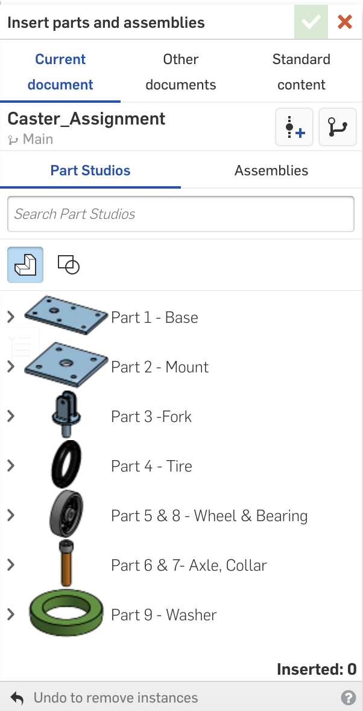

# Basic_Onshape_CAD
Onshape CAD for Engineering 4

## Part 1 - Base

### Lesson Learned
I had trouble understanding the way sketches and dimensions worked within Onshape, but as I continued the part I started to get the hang of dimensions. Without the video Dr. Shields provided I probably wouldve taken much more time to finish this piece.

### Picture

## Part 2 - Mount

### Lesson Learned
As this one was very similar to make like the last one, it was easier for me to go through the motions of where to find the different tools to dimension and constrain the part. The video was helpful and watching him make it 3 different ways really showed the longevity of Onshape and how much different it is than Solidworks.

### Picture

## Part 3 - Fork

### Lesson Learned
Last year I had the most trouble making this part when doing this assembly, but that was not the case this year. I knocked this out in about 15 minutes and it baffled me how fast and easy Onshape makes some of the tools. The craziest part for me was doing Fillets and since it has Tangent Propagation, I only had to select 5 lines total and the whole thing was filleted. Last year you would have to select 10 or 15.

### Picture

## Part 4 - Tire

### Lesson Learned
In SolidWorks, making this part was relatively easy, the only hard part being the symmetric and the fillet but in Onshape it was so much easier. I like the accessibility of the relations like how coincident, symmetric, horizontal and others are all under 1 tab. It makes this part really easy!

### Picture

## Parts 5 & 8  - Wheel and Bearing

### Lesson Learned
The wheel took me only about 10 minutes as I started to fully grasp Onshape when building it. In SolidWorks last year, it took me 2 days. The way you can easily access the relations also expeditied the time it takes for this one. When I built the bearing I finally understood the "Use" tab which makes everything easy to access even if it is a different part. Overall one of the easiest parts to build because I understand where everything is.

### Picture

## Parts 6 & 7 - Axle and Collar

### Lesson Learned
I like how when building the axel you can keep the planes on your sketch open the whole time, it made mirroring the flat top of the axel easy, and then how you can implement the second part just by sketching made doing the collar really easy. Usually in SolidWorks I would have to take note of the sizes of the axel and then dimension it, but by "Using" and coincidenting the circle in the sketch it made that step irrelevant.

### Picture

### Part 9 - Washer

### Lesson Learned
This part was pretty simple, just put two holes and extrude. It took me about 30 seconds and I dont know if I learned anything worth noting.

### Picture

## Subassembly - Wheel & Axle

### Lesson Learned
This was my first time using Onshape for an assembly and I will say I like it jsut as much as I did SolidWorks. I have to get used to the mate connectors and selecting the right one, but this is very easy and it takes many less mates. The animation feature for the revolve mates is really cool so you can see if you do it right.

### Picture

## Assembly - Caster

### Lesson Learned
With this I finally finished the Caster Assignment. I found it really helpful in learning the basics of Onshape and I hope to figure out more things to do with it. I did go against teh grain and make every part and assembly in 1 document. This was really helpful because I got to see just how easy it is for you to access something when building towards a goal. I am putting a picture in to show how easy it was to access parts when making the assembly. The revolve mates got easier this time but they were still relatively hard to put in.

### Picture

 

# Onshape Challenge

## Onshape Challenge

### Lesson Learned

The vast array of functions and mates int Onshape makes doing CAD very easy. I had trouble at first understanding the cylindrical mates, but they turned out to be very beneficial. I also didn't know what a thin feature was. The Thin Feature was a great idea implemented by Onshape and it helps make complicated pieces much easier. I probably will use the thin feature/thicken tool again.

Link to Document:
https://cvilleschools.onshape.com/documents/b9e1ab871ec1772c3eea9db0/w/8efde8e652d39148fc7691c0/e/e0aa4f456a71eb82edaefef3

### Pictures

                        
                       

# Dorothy's Dowel Pins

## Dorothy's Dowel Pins

### Lesson Learned

This lesson I learned a lot about configurations. I had lots of trouble with configurations in SolidWorks, but it seems Onshape mitigates the issues I had by being much more effective with how you use them. The configurations of the dowel pins was a great lesson to help me learn how to configure and even the configuring of the Block helped me understand how you can do so much with only 1 part.

### Pictures

           

